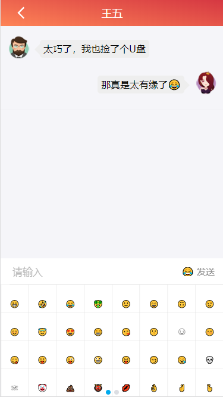
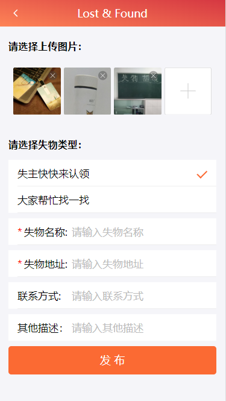

## 项目简介
这个项目所用的技术框架为react + express + mongodb + antd_mobile，运用socket实现聊天功能，其应用的功能为发布失物的信息，然后失主可以直接和拾到失物的人进行聊天

## 项目运行
```
git clone https://github.com/Crazy-LD/LostAndFound_client.git

cd lostAndFound_client

npm install

npm start

访问http://localhost:3000
```

## 后端代码

[后端代码](https://github.com/Crazy-LD/LostAndFound_server)

## 功能

- [x] 用户(管理员)登录
- [x] 注册
- [x] 修改密码
- [x] 修改用户信息
- [x] 发失物招领信息
- [x] 改变失物招领的状态
- [x] 聊天

## 页面截图
      

## 项目结构

```
weibo_client
  - build
  - node_modules
  - printscreen               // 项目截图
  - src
    - api
      - ajax.js               // ajax函数请求
      - api.js                // 接口请求模块
    - assets
      - images                // 公共图片
      - css                   // 公共样式
    - components              // 公共组件
      - header-selector       // 选择头像
      - loginAndRegister      // 登录注册公共组件
      - logo                  // logo组件
      - nav-footer            // tabBar
      - not-found            `// 错误提示
      - user-list             // 失物展示列表
    - containers              // 容器组件
      - admin                 // 管理界面
      - changePassword        // 修改密码
      - chat                  // 聊天页面
      - complete-info         // 完善信息
      - home                  // 主页
      - login                 // 登录
      - main                  // 主要的路由跳转
      - message               // 消息列表
      - personal              // 个人主页
      - register              // 注册页面
      -sendMsg                // 发布失物信息
    - redux                   // 状态管理
      - actions.js            // 异步分发
      - reducer.js            // 所有reducer的集合
      - action_types.js       // mutation常量
      - store.js              // 创建存储容器
    - test                    // 测试socket
```
